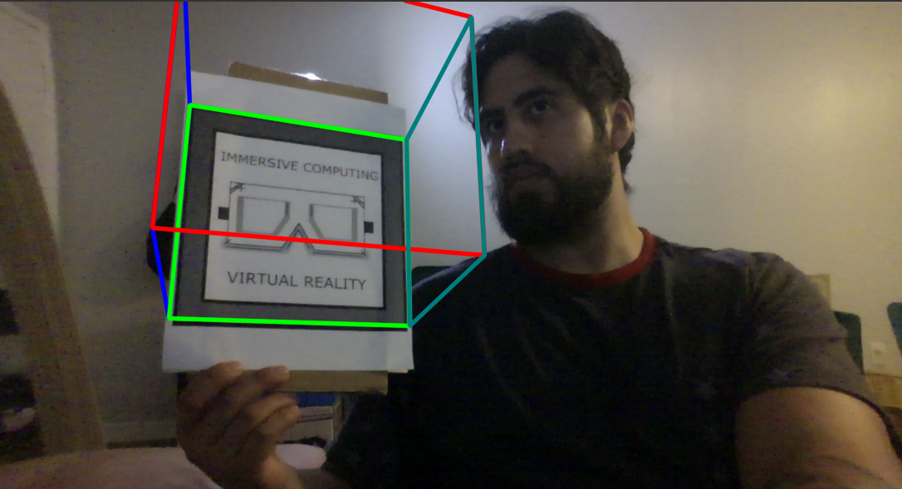

# 3D



**Want to learn 3D using OpenCV and Python3 ?**

This work was created in collaboration with Joe Menke and Wayne Zhu at the University of Califrnia, Berkeley.

We are grateful for the guidance of proffesors Alan Yang and Yi Ma, along with the greater FHL Vive Center for Enhanced Reality community at UC Berkeley.

**Here's the Math:**

.png)

My goal is to find how to make the tracker follow the movement of the tracker image as it moves in real time. Currently, the cube must re-spawn. 

Feel free to add any improvements or additions!

Prequisites:
-Python installed
-OpenCV installed
-calibration_checker.png and ARTrackerImage.jpg printed

Step 1:
Before we calibrate the camera, use your printed checkerboard image and paste it to a flat surface such as a clipboard or piece of cardboard. Create a folder, run this code, and hit the space key to take a picture of the calibration pose. The more poses the better (20-30 works good).

``` ruby
$ import CalibrationHelpers as calibrate
mkdir calibration_data
calib.CaptureImages('calibration_data')
```

Step 2: To run the actual camera calibration and detect the corners, use:

``` ruby
$ import CalibrationHelpers as calibrate
intrinsics, distortion, roi, new_intrinsics =\
calibrate.CalibrateCamera('calibration_data', True)
```
Make sure your printed reprojection error is less than 1 ! If it is greater, re-take your image poses and run a second calibration!

Otherwise, save your calibration data.

``` ruby
$ calibrate.SaveCalibrationData('calibration_data', intrinsics, distortion, new_intrinsics, roi)
```

paste the ARTrackerImage to the other side of your cardboard, hold it up to the camera, and use ARImagePoseTracker.py to spawn the 3D cube.
``` ruby
$ python3 ARImagePoseTracker.py
```


Made available by the BSD 3-Clause License. 2020


Omni Astrobiotics©. 2021.

www.omniab.us

